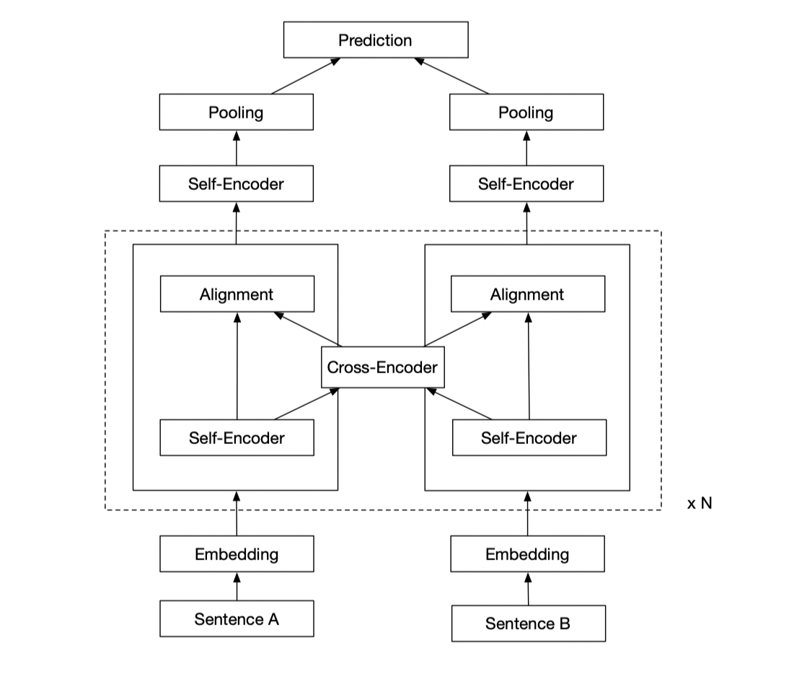

Sentence Matching With Deep Self-Attention and Co-Attention Features

## Introduction

### Motivation
* Transformers 强大编码能力；
* Transformers运行速度优势；

### Contribution
* 目前来看，第一个在编码阶段仅使用Attention机制，其他论文均是要用CNN或者LSTM提取特征
* 保持领先的准确率的同时，减少模型推理时间

## Framework

### Embedding
使用预训练好的开源词向量，glove-800B-300D

### Self-Encoder
使用Self-Attention对句子进行编码

### Cross-Encoder
使用Cross-Attention对两个句子进行交互编码

### Add-Norm
Add是一个残差连接，Norm是一个LayerNorm

### CNN-Pooling
CNN-Pooling是指使用TextCNN对输出进行Pooling操作

### Prediction
Prediction是一个两层的全联接网络，输入是[a, b, a-b, abs(a-b), a * b]

## Experiments
### Experiments on SNLI
Todo

| Num | Model | Acc on SNLI test | 
| :-: | :-: | :-: |  
| 1 | ESIM | 88.6 | 
| 2 | RE2 | 88.9 | 
| 3 | DRCN | 88.9 | 
| 4 | Our Model | 88.72 | 

注意：88.72是之前跑出来的，当时没保存模型，记得大概模型参数，现在在复现
 
 

### Experiments on Quora
Todo

### Experiments on WikiQA
Todo

## Conclusion
* 模型能达到State-of-the-art，验证了模型的有效性
* 模型推理时间减少了***倍，验证了模型的实用性
